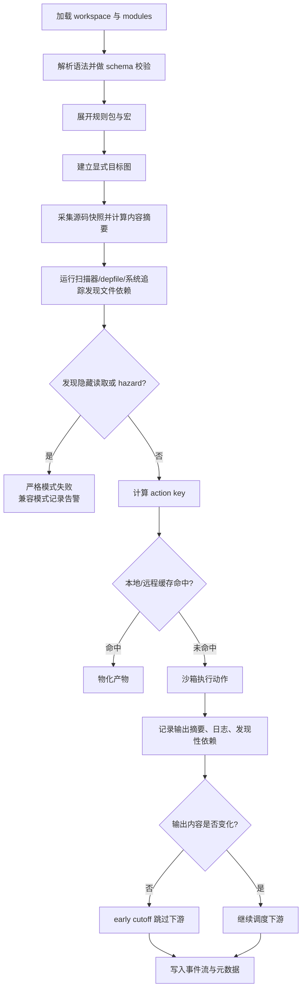
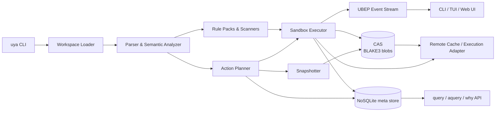
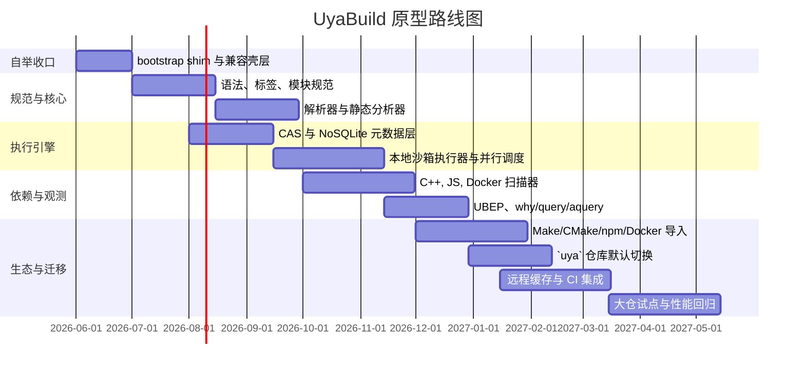

# Uya 默认构建系统评审：用 Uya 自举实现

## 执行摘要

GNU Make 的痛点并不只是“老”，而是它把**文件依赖、任务编排、Shell 执行、默认行为、变量展开和隐式推导**混在一个语义层里。GNU Make 手册明确要求 recipe 行以 tab 开头，甚至直接把这个规则称为容易“坑到没准备的人”的晦涩点；默认目标又是“第一个规则的第一个目标”，规则顺序因此带有非局部语义；变量赋值同时存在 `=`、`:=`、`::=`、`:::=`、`?=`、`+=`、`!=` 等多种形式，而且展开时机不同；隐式规则还会根据“哪些前置文件存在或可生成”去选择实际执行的规则；是否过期则核心依赖文件修改时间；调试虽然有 `-d/--debug` 和 `--trace`，但输出非常啰嗦，且并行构建时标准输出会交错。换句话说，Makefile 的很多“最大痛点”并不是偶发设计失误，而是其核心抽象长期累积后的结果。

中文一线开发反馈与官方文档的方向高度一致。社区文章集中批评 Make 的隐式默认行为、`.PHONY` 这种“把任务伪装成文件”的绕行方案，以及“介于配置和语言之间的四不像”体验；高德技术团队则把跨平台、多 IDE、多工具链、大项目膨胀、依赖管理混乱视为传统 Make/CMake 体系在工程化上的关键瓶颈。虽然这类反馈不等同于规范，但它们与 GNU Make/CMake/Bazel/Ninja 等官方文档暴露出的语义现实是互相印证的。

因此，真正值得设计的新系统，不应该只是“更像 YAML 的 Makefile”或“换一种宏语言的 CMake”，而应当把构建系统拆成四层：**显式的目标图、可验证的文件依赖发现、内容寻址的变更检测、可观测的执行事件流**。构建系统研究已经把设计空间总结得相当清楚：静态/动态依赖、本地/云、确定性/非确定性、是否支持 early cutoff、持久化记录何种信息，都会直接决定系统行为；而 forward build system 的研究又表明，自动推断依赖是可行的，但必须以系统追踪、危险冲突检测和正确性定义为前提。

基于这些事实，我建议的新系统以 **UyaBuild** 为工作名，并直接作为 `uya` 的默认构建前端交付。它不是简单替代编译器、包管理器、Docker 或 Bazel，而是做统一的**构建控制面**：用一种**无 tab、单赋值操作符、显式默认目标、任务与产物分离、插件化规则包、内容哈希驱动增量、沙箱/追踪校验隐藏依赖、BEP 风格事件协议**的新模型，来编排 C/C++、JS 前端、Docker 镜像、多语言 monorepo 乃至微服务交付流水线。CMake、Ninja、Docker Buildx、npm Workspaces、Bazel Query/BEP/缓存等已有能力，不应被推倒重来，而应通过导入、导出、适配和后端复用纳入统一体系。这里的关键收束是两点：**实现语言优先选 Uya 本身**，以及**用户入口收敛到 `uya build / test / query / why`**，而不是继续维护一套平行的外部构建工具。

对 `uya` 仓库现状做针对性评审后，这个结论更明确了。当前顶层 [`../uya/Makefile`](../uya/Makefile) 已经达到约 1196 行，默认目标仍是 `all: help`，但同一文件同时承载了 `from-c`、`from-c-native`、`uya`、`tests`、`check`、`release`、`install` 等冷启动、自举、测试、发布与安装职责；其中 `check` 单个目标又串起大量 shell 脚本和临时文件，`release` 还把干净树校验、seed 同步、测试、打包耦合在一条长链上。对一门强调“显式、可证明、可读”的语言来说，这种入口形态已经和产品哲学不一致。

因此这份评审给出四个明确结论：

| 评审项 | 结论 | 理由 |
|---|---|---|
| 实现语言 | **用 Uya 实现 UyaBuild** | 最能验证 Uya 在 CLI、文件系统、进程编排、模块化上的真实可用性，也能避免核心工具长期依赖 Rust/Go/Make 的心智分裂 |
| 默认入口 | **把 `uya build` 作为主入口** | 用户应记住的是 `uya`，而不是 `make` 或另一个二进制名；`uya test/query/why/release` 也可自然并列 |
| 自举边界 | **保留一个极小的 C/Make bootstrap 层** | Uya 编译器需要先从 seed 启动，不能让“用 Uya 写的构建系统”陷入自举循环 |
| 迁移策略 | **先让 Makefile 退化为兼容壳层** | 第一阶段不追求一次性删掉 Make，而是把它收缩成 `bootstrap` 和命令转发层，逐步退场 |

更具体地说，我建议把 `uya.build` 提升为全生态统一入口：根 `uya.build` 同时承载 workspace 元数据、目标图与规则声明，`uya` 二进制负责解析、规划、执行和解释构建结果；现有 `uya.toml` 则降级为可选兼容清单，仅在迁移期或外部工具集成时保留静态元数据。这样 `uya` 语言和 `uya build` 构建前端会形成更直接的自举闭环，同时又不给现有生态制造硬切换成本。

## Makefile 的核心痛点与竞品对比

Makefile 最难长期维护的地方，不在于“写法老派”，而在于它把**隐式约定**当成主路径。默认目标由文件内顺序决定，recipe 用 tab 区分，自动变量如 `$@`、`$<`、`$^` 只在 recipe 作用域内有效，`.PHONY` 用来把“任务”伪装成“不是文件的目标”，隐式规则又会在没有显式 recipe 时自动搜索并套用，这些行为彼此叠加，导致读者必须同时记住语法、时机、上下文和搜索策略。GNU Make 自己也承认这些点会“坑到没准备的人”。

与此同时，现代生态已经天然分裂出了更高语义层：CMake 已经不是“多平台 Makefile 模板”那么简单，而是一个可生成 Ninja、Makefile、Visual Studio、Xcode 等后端的元构建系统，并提供 Presets 与 File API；Bazel 把工程组织成 repository/workspace/package/target，并用 action cache、CAS、BEP、query/aquery 等能力支撑大型多语言工程；Ninja 明确把自己定位成“构建汇编器”，强调生成而不是手写；npm Workspaces、Docker Buildx 也分别把前端包工作区和容器构建缓存/元数据/证明做成了一等能力。把这些系统再压平为 Makefile+Shell，会直接损失语义和可观测性。

下表不是“谁更强”的简单排名，而是为了明确 UyaBuild 应该吸收什么，不应重复什么。

| 系统 | 特征 | 优缺点 | 复杂度 | 适用性 |
|---|---|---|---|---|
| Make | 基于文件规则、修改时间、隐式规则、自动变量 | 优： ubiquitous、轻量；缺：tab 敏感、默认目标隐式、赋值/展开语义多、`.PHONY`/隐式规则/mtime 容易让维护与调试成本失控。 | 中 | 适合小型、本地、单语言或遗留 C/C++；不适合大型多语言和云原生场景 |
| CMake | 元构建系统，可生成 Makefile/Ninja/IDE 工程；支持 Presets 与 File API | 优：跨平台、后端丰富、生态深；缺：语言层次多，实践上常出现“配置一层、生成一层、执行一层”的心智负担。其官方路线也在向 Presets + File API 靠拢。 | 高 | 适合 C/C++ 主导工程；作为互操作入口非常重要 |
| Bazel | 高层 BUILD 语言、包/标签模型、hermetic、远程缓存、Query/AQuery、BEP | 优：多语言、大仓、缓存/可观测性强；缺：规则生态与心智模型重，迁移成本高。 | 高 | 适合大型 monorepo、严格工程治理、远程执行 |
| Ninja | 低层执行器，强调速度、无内置规则、通常由别的系统生成 | 优：极快、日志与命令变更跟踪清晰、默认并行、输出缓冲；缺：不是高层语言，不适合手写复杂工程。 | 低 | 适合作为执行后端，不适合作为统一控制面 |
| Just | 命令运行器，不是构建系统 | 优：比 Make 直观、跨平台、错误更友好、支持参数和多语言 recipe；缺：不解决真实的构建图、增量、缓存、文件级依赖。 | 低 | 适合开发者命令编排，不适合大型增量构建 |
| Taskfile | 跨平台任务运行器，支持依赖、并发、checksum/timestamp/status | 优：比 Just 更接近“增量任务”；缺：本质仍是任务系统，不是严密的动作图与构建语义系统。 | 低到中 | 适合代码生成、自动化任务；不适合深度构建治理 |

如果把上述工具放到用户列出的痛点清单里看，结论其实很清楚：**Make 的问题不是“缺少某个功能”，而是抽象层错误**；Ninja 解决的是速度和执行器问题，不解决语言与治理；Just/Taskfile 解决的是任务体验，不解决构建正确性；CMake 与 Bazel 则分别代表“元构建”和“强治理构建”的两种成熟路线。UyaBuild 的最佳位置，不是重新造一个 Bazel，也不是把 CMake 语法换皮，而是构建一个**更容易迁移、更适合多语言/容器/前端/微服务、同时保留严格正确性能力**的中层控制面，并且优先在 `uya` 自己身上完成 dogfood。

## 新系统设计目标与优先级

构建系统研究已经把关键设计轴总结得很系统：静态与动态依赖、是否支持 early cutoff、本地与云、以及持久化记录哪些信息，都会决定系统的正确性、性能和可扩展性。Bazel 的 hermeticity 文档则进一步说明，如果不给工具链、依赖和宿主环境建立隔离，缓存命中、并行执行和可复现性都会被削弱。UyaBuild 的设计目标应该直接围绕这些轴展开，而不是围绕“语法像不像某种熟悉配置文件”展开。

对 `uya` 来说，还应增加一条专属优先级：**默认构建系统必须服务自举链**。也就是说，设计不能只考虑一般应用仓库，还要考虑 `../uya/Makefile` 里今天真实存在的 `from-c`、`from-c-native`、`uya`、`b`、`check`、`release`、`install` 这些阶段如何映射到新图模型。只要新系统不能清晰表达这些流程，它就还不够资格成为 `uya` 的默认构建系统。

我建议把能力优先级分成三层：**必须首发的构建正确性能力**、**尽快补齐的大规模工程能力**、**生态整合与云端能力**。这样做可以避免系统一开始就陷入“插件很多，但基础语义不稳”的陷阱。

| 优先级 | 能力 | 设计要求 |
|---|---|---|
| 核心 | 显式标签目标、单赋值语义、无 tab、显式默认目标 | 彻底消除 Make 风格的隐式入口、tab 敏感、赋值展开困惑 |
| 核心 | 任务与产物分离 | `task` 不再伪装成文件；`artifact`/`image`/`service` 各自有独立语义 |
| 核心 | 内容哈希驱动增量 | 默认不用时间戳判断过期，所有 cache key 面向输入内容与执行环境 |
| 核心 | 显式目标图 + 可验证的动态依赖 | 结构依赖必须声明，文件级依赖可由扫描器/depfile/追踪补充，但必须可审计 |
| 核心 | 沙箱执行与缓冲日志 | 并行不改变结果，不让控制台成为调试障碍 |
| 增强 | `query / aquery / why / explain` | 把“为什么重建”“为什么没命中缓存”“谁依赖我”变成一等命令 |
| 增强 | 多语言规则包 | C/C++、Node、Docker、Go/Python/Java 先做内建适配层 |
| 增强 | monorepo 模块系统 | 标签、包边界、模块清单、外部依赖版本锁定 |
| 生态 | CMake / Ninja / Bazel / Docker / npm 互操作 | 导入、导出、代理执行、共享缓存协议/事件流 |
| 生态 | 远程缓存与远程执行 | 在本地语义稳定后再推向云端，避免“先分布式、后排错”的高风险路线 |

这组优先级背后的原则可以概括为五句：**默认显式、推断可证、缓存基于内容、并行不改变结果、交互必须可解释**。这实际上同时借鉴了 Ninja 的“执行器应当极简且可预期”、Bazel 的“缓存与观察能力一等化”、Task 的“checksum 比 timestamp 更可靠”、以及 Shake/forward build system 对动态依赖的严肃处理。

## 语言与语法提案

UyaBuild 的语言要解决的不是“更短”，而是“让正确的东西更容易写，错误的东西更难写”。因此我建议它采用以下约束：只保留一个赋值操作符 `=`；变量默认不可变；默认目标必须显式声明；没有内置隐式规则搜索；没有 tab 语义；目标名采用 `//pkg:path` 标签；`task`、`artifact`、`image`、`service`、`test` 是不同声明，而不是同一种“目标文件”的变体。这样做，正是对 Make 的规则顺序默认目标、自动变量作用域、`.PHONY`、多赋值语义和隐式规则的一次结构性反转。

更具体地说，我建议把语言分成两层。第一层是**声明式核心**，用于表达包、目标、输入、输出、依赖、工具链、环境白名单、缓存策略。第二层是**受控逃逸层**，允许在 `legacy.shell` 或 `script` 块里调用现有命令，但必须显式声明输出、可选声明输入，并且在严格模式下接受扫描器或系统追踪校验。这比“全都塞进 Shell recipe”更适合迁移，也比“一上来就要求用户全写 SDK 代码”更现实。其思路与 forward build system 通过系统追踪记录读写、再把脚本提升成增量系统的路线是一致的。

语言层面我建议使用**带 schema 的块声明**。也就是说，`cxx.binary`、`node.app`、`oci.image` 都是带字段验证的目标种类；未知字段在解析期直接报错，而不是拖到运行时。这一点可借鉴 CMake File API/Bazel Query 的经验：工具必须能读懂构建图的语义对象，而不是只能解析一堆 shell 字符串。

从 `uya` 生态落地的角度看，我建议 DSL 文件名直接采用 `uya.build`，并允许根文件直接声明 `workspace`。默认情况下，小中型项目只需要一个根 `uya.build`；大型仓库再通过 `include` 拆分多个 `uya.build`；如果需要兼容现有生态，再额外保留一个只承载静态元数据的 `uya.toml`。这样用户看到的主入口会稳定成“`uya.build` + `uya` 命令”，而不是继续维护两个同等地位的配置文件。

### 语法骨架

```uyabuild
workspace {
  name = "acme"
  default = ["//app:cli"]
  strict = true
}

config "debug" {
  defines = { mode = "debug" }
}

config "release" {
  defines = { mode = "release" }
}
```

### C 和 C++ 构建示例

```uyabuild
use cxx

cxx.library "//lib:math" {
  srcs = glob("lib/math/**/*.cc")
  hdrs = glob("lib/math/**/*.h")
  include_dirs = ["lib"]
  discover = cpp.headers()
  visibility = ["//app:*"]
}

cxx.binary "//app:cli" {
  srcs = ["app/main.cc"]
  deps = ["//lib:math"]
  out = "out/bin/cli"
  toolchain = "clang17"
  config = select({
    "debug"   = { cflags = ["-O0", "-g"] },
    "release" = { cflags = ["-O3"] }
  })
}

task "//:clean" {
  always = true
  run = ["rm", "-rf", "out", ".uya-build"]
}
```

这个例子对 Make 的几个历史问题做了直接替换：没有 tab；没有 `$@/$</$^`；没有默认第一目标；`clean` 是 `task` 而不是 `.PHONY`；头文件依赖由 `discover = cpp.headers()` 明确声明为“由扫描器补充的文件级依赖”，不是依赖隐式规则和人工维护。其设计方向吸收了 Ninja 对 C/C++ 头文件依赖发现和命令行变更重建的经验，但把它提升到了高层 DSL。

### JS 前端构建示例

```uyabuild
use node

node.workspace "//frontend" {
  root = "apps/web"
  package_manager = "npm"
  workspaces = true
  lockfile = "apps/web/package-lock.json"
}

node.app "//frontend:web" {
  root = "apps/web"
  install = npm.ci()
  build = npm.script("build")
  srcs = [
    "apps/web/package.json",
    "apps/web/package-lock.json",
    glob("apps/web/src/**/*"),
    glob("packages/ui/src/**/*")
  ]
  outputs = ["apps/web/dist/**"]
  discover = npm.workspace_graph()
}
```

这段设计的重点是：前端不是一个“目录里跑一下 `npm run build` 的 Shell 任务”，而是一个知道 lockfile、workspace、脚本名、输出目录和依赖图的**一等目标类型**。npm 官方已经把 `scripts`、`node_modules/.bin` 注入、`workspaces` 执行范围这些行为固化为 CLI 语义；因此，新系统不该要求开发者重新用 Makefile 手写一层“二次解释器”。

### Docker 镜像构建示例

```uyabuild
use oci

oci.image "//services/api:image" {
  context = "."
  dockerfile = "services/api/Dockerfile"
  target = "runtime"
  args = {
    GIT_SHA = vcs.commit()
    VERSION = "1.2.3"
  }
  cache_from = ["registry://registry.example.com/cache/api"]
  cache_to = ["registry://registry.example.com/cache/api"]
  metadata_out = "out/api-image.json"
  provenance = true
}
```

官方 Buildx 已经支持 `--cache-from`、`--cache-to`、`--metadata-file` 和 provenance attestations；因此新系统对 Docker 的正确集成方式不是“把 docker build 命令替你拼起来”，而是让镜像构建变成**有输入、有输出元数据、有缓存策略、有目标阶段概念**的一等节点。

### 多语言 monorepo 示例

```uyabuild
module {
  name = "acme-monorepo"
  version = "0.1.0"
}

include "services/**/uya.build"
include "libs/**/uya.build"
include "packages/**/uya.build"

service "//release:gateway" {
  deps = [
    "//services/api:image",
    "//frontend:web",
    "//libs/shared:contracts"
  ]
  manifests = ["deploy/k8s/gateway.yaml"]
  outputs = ["out/release/gateway.bundle"]
}
```

这个例子强调的是：**发布单元**和**编译单元**不再混在一起。`service` 目标可以依赖镜像、前端产物、共享契约，再产出一个可部署 bundle。这样就能把“多语言”“微服务”“容器”“前端”收敛到同一个图里，而不是继续让 Makefile 成为各类工具的字符串粘合器。Bazel 的 package/label/workspace 模型已经证明，大仓需要先有边界与标签，再谈缓存与并行。

## 依赖模型、变更检测与执行语义

UyaBuild 最关键的设计，不是语法，而是**依赖到底如何表示和验证**。我的建议是采用四层依赖模型。第一层是**目标层依赖**，也就是 `deps = ["//lib:math"]` 这种结构性依赖，必须显式声明；第二层是**文件层依赖**，由 `srcs`/`hdrs`/`outputs` 明确给出；第三层是**工具链依赖**，把编译器、Node、Docker builder、脚本解释器都当成可哈希的输入；第四层才是**发现性依赖**，例如 C/C++ 头文件、生成文件的二次依赖、legacy shell 读写文件。只有这样，系统才能既避免 Make 那种“全靠人手写依赖”，又避免纯 forward build system 那种“全都靠运行后再猜”的不透明。构建系统研究表明，静态与动态依赖本来就是一个核心设计轴；而 Shake 与 Rattle/forward build system 的经验则表明，动态依赖可以做，但必须被记录、校验和重放。

在变更检测上，我建议默认完全放弃时间戳作为核心依据。GNU Make 的过期判定就是“目标是否比任一前置条件更旧”；《Build Systems à la Carte》也明确指出，`touch` 一类行为会破坏其最小性假设。相反，Task 已经证明哪怕是任务运行器，也能用 checksum 而不是 timestamp 做 up-to-date 判定；Bazel 的远程缓存则把动作结果建立在 action hash 与内容寻址存储之上；Ninja 也会把命令行变化纳入重建判定。把这些成熟实践组合起来，UyaBuild 的默认 action key 就应当是内容哈希，而不是 mtime。

我建议 UyaBuild 的动作指纹采用如下结构：

```text
action_key = blake3(
  rule_kind,
  rule_schema_version,
  normalized_command,
  declared_input_digests,
  discovered_input_digests,
  toolchain_digest,
  env_allowlist,
  platform,
  mount_policy,
  output_contract
)
```

这意味着只要源码、生成脚本、命令参数、工具链版本、白名单环境变量、平台或发现性依赖发生变化，动作 key 就会变化；否则复用缓存。对特别大的 vendor 目录或遗留包装目标，可以提供 `method = "timestamp"` 的兼容模式，但必须显式标记，而且默认不启用。这个策略既能兼容现实，又避免一开始就把系统拖回 Make 的时间戳语义。

在执行语义上，我建议把目标分成三类。第一类是 `pure`，要求严格沙箱、完全可缓存、允许远程执行；第二类是 `host`，允许读取少量白名单宿主信息，但默认只做本地缓存；第三类是 `volatile`，明确声明非确定性，不参与远程缓存，也不做 early cutoff。Bazel 的 hermeticity 文档已经把没有隔离时会出现的问题说得很明确：宿主差异、时间戳、系统二进制、写入源码树都会破坏重现性与缓存命中。

early cutoff 应该成为 UyaBuild 的默认能力。也就是说，一个动作即使被执行了，只要新输出与旧输出内容摘要相同，下游动作就不必继续执行。《Build Systems à la Carte》把这一点作为 Shake/Bazel 与 Make/Excel 的关键差异之一。对源文件小改动但目标内容不变的情况，这能显著降低“无效级联重构建”。

下面这张图展示了 UyaBuild 的依赖解析与执行流程。它的关键不是“是否推断”，而是**推断之后是否被纳入可验证的动作记录**。



并行模型则应当像 Ninja 那样默认并行，但比 Ninja 更强调**结果确定性**。Ninja 默认并行、缓冲输出、避免日志互相穿插，这些都是值得继承的执行层经验；而 UyaBuild 还应再增加资源池与原子提交：`pool = "link"`、`pool = "docker"`、`pool = "network"`、`pool = "license:foo"`，动作只允许在私有工作目录写入声明输出，成功后再原子提交到产物目录。这样，并行只改变速度，不改变结果和观测。

## 可观测性、调试与大规模工程策略

Make 的一个根本性体验问题是：你很难用一个统一模型回答“为什么它重建了”和“为什么它没重建”。虽然 GNU Make 有 `-d/--debug` 与 `--trace`，但输出过于接近内部实现细节，并且并行输出可能互相穿插。相比之下，Bazel 已经把事件、查询、执行日志、trace profile、execution graph log 全都视为一等接口；Ninja 也提供了 `-t graph`、`-t inputs`、`deps`、`missingdeps`、`.ninja_log` 等一整套可视化和诊断工具。UyaBuild 必须从第一天起把“可解释性”做成产品功能，而不是调试选项。

因此，我建议 UyaBuild 内建一套 **UBEP: Uya Build Event Protocol**。它应采用与 BEP 类似的 DAG 事件模型：`BuildStarted`、`TargetConfigured`、`ActionScheduled`、`ActionExecuted`、`BuildMetrics`、`BuildFinished` 等事件按父子关系公告；CLI 可输出 text/JSON/binary；CI 与 IDE 则消费事件流而不是解析控制台文本。Bazel 的 BEP 已经证明，这样的协议可以同时服务 IDE、dashboard、CI、远程调试和历史分析。

在命令层，我建议至少提供以下查询能力，并把它们直接挂到 `uya` 主命令下：

- `uya query //pkg/...`：目标图查询
- `uya aquery //pkg:target`：动作图、命令行、输入输出、缓存属性
- `uya why //pkg:target`：解释“为什么执行/为什么被跳过/为什么脏”
- `uya explain file path/to/x.h`：解释该文件影响哪些目标
- `uya replay <action-digest>`：在隔离环境重放失败动作
- `uya diff-run runA runB`：比较两次构建的动作键、依赖和环境差异

这些命令分别吸收了 Bazel 的 `query/aquery`、execution log diff、BEP，以及 Ninja 的 `graph/inputs/missingdeps` 思路。真正的目标不是“命令丰富”，而是让 stale build、隐藏依赖、缓存 miss、关键路径拖慢点，都能被**结构化地定位**。

大规模工程方面，UyaBuild 应该采用**包边界 + 模块清单 + 惰性加载**的策略。Bazel 之所以能在 monorepo 中工作，不只是因为缓存强，而是因为 repo/workspace/package/target 边界清晰；Bzlmod 又把外部依赖管理提升到了模块层。中文一线团队经验也支持这一点：高德在构建演进中首先解决的是多平台、一套配置、多 IDE、复杂工具链与依赖分离，而不是单纯追求“脚本更简洁”。

具体到多语言、前端、微服务、云场景，我建议 UyaBuild 提供**一等目标种类**而不是“推荐模板”。例如：

- `cxx.library / cxx.binary` 负责编译图与头文件发现；
- `node.app / node.package / node.workspace` 负责 lockfile、workspace、脚本边界；
- `oci.image` 负责镜像、阶段目标、缓存与 provenance；
- `service` 负责把镜像、前端 bundle、配置清单和部署包收敛为一个发布单元。

这样可以把“多语言 monorepo”收敛到统一标签图，而不是让每种语言都再带一套平行的“顶层脚本系统”。npm Workspaces、Docker Buildx、Bazel 多语言与模块设计都表明：前端、容器和多语言并不是特殊边缘场景，而是现代构建的常态。

## 互操作、迁移路径与原型架构

UyaBuild 不应该要求团队“一夜切换”。真正可落地的路线必须允许旧系统继续存在，同时逐步把它们纳入统一图和统一缓存语义中。

与 CMake 的互操作，最佳入口不是解析 `CMakeLists.txt` 文本，而是利用 **CMake File API** 与 **Presets**。File API 可以让外部工具读取 CMake 生成构建系统的语义信息，Presets 则是官方推荐的共享配置入口；而且 CMake 已经明确把 IDE 方向逐步收敛到 File API，而不是旧式 Extra Generators。UyaBuild 可以先实现 `uya import cmake`：消费 File API codemodel、读取 Presets 中的配置矩阵，把 CMake 子项目当作受控外部图节点；后续再实现 `uya export cmake-presets`，为需要保留 CMake 入口的团队生成兼容配置。

与 Ninja 的互操作应分成两种。一种是**导出后端**：UyaBuild 在稳定阶段可把某些纯动作图导出为 `build.ninja`，把 Ninja 作为极速执行后端。另一种是**吸收诊断能力**：读取 depfile、产出 `compile_commands.json`、兼容使用 `ninja -t compdb / graph / inputs / missingdeps` 的工具链。Ninja 官方哲学非常清楚：它是“构建汇编器”，应被更高层系统驱动。UyaBuild 正适合站在这个上层。

与 Bazel 的互操作，不建议第一阶段就做 BUILD/Starlark 双向翻译；那会把项目拖进另一个宏语言兼容层。更稳妥的路径是三步走：首先允许 `external.bazel` 目标把 `bazel build //x:y` 封装为一个外部动作，并消费 Bazel 的 BEP 结果；其次允许导入 Bazel 的 query/aquery 结果，建立跨系统引用关系；最后在远程缓存与执行层考虑协议兼容。这样可以复用 Bazel 已有缓存、BEP 和大仓能力，而不是重写它。

与 Docker 的互操作则应该直接建立在 Buildx 之上。因为 Buildx 已支持 `--cache-from/--cache-to`、`--metadata-file`、`--call=check|outline|targets` 和 provenance，所以 UyaBuild 的 `oci.image` 目标完全可以在前端做目标建模，在后端直接调用 Buildx。这样既能保留 OCI/tooling 生态，又能把镜像构建纳入统一日志、统一缓存统计和统一 DAG。

与 npm 的互操作重点不是“能跑 npm 命令”，而是**理解 workspace 与 lockfile**。npm 文档已经定义了 `workspaces` 的组织方式、`npm run` 的参数透传、`node_modules/.bin` 注入、脚本运行目录与 shell 依赖。UyaBuild 应在规则层吸收这些语义，让 Node 目标声明“我依赖哪个 lockfile、哪些 workspace、哪个 script、输出目录在哪里”，而不是要求用户再写一层 bash 条件分支。

### Makefile 迁移路径

我建议迁移按“五步法”推进，而不是直接重写。对 `uya` 本仓来说，还应额外补一个**第零阶段 bootstrap 约束**：先允许一个极小的 `make bootstrap` 或 `./bootstrap.sh` 只负责从 C seed 得到首个可运行 `bin/uya`，一旦这个边界跨过去，后续开发者入口就统一切到 `uya build/test/check/release/install`。

对 `../uya/Makefile` 的核心目标，我建议按下面方式收口：

| 当前入口 | 新入口 | 备注 |
|---|---|---|
| `make from-c` / `make from-c-native` | `make bootstrap` | 保留为冷启动兼容层，不再承担常规开发入口 |
| `make uya` / `make uya-hosted` / `make uya-portable` | `uya build //compiler:uya` | hosted/nostdlib/portable 变成配置矩阵，而不是不同手写 recipe |
| `make tests` / `make tests-hosted` | `uya test //tests/...` | 测试选择与 profile 进入显式目标图 |
| `make check` / `make check-hosted` | `uya check //...` | 汇总验证逻辑进入结构化 pipeline，而不是大段 shell 串联 |
| `make release` / `make release-clean` | `uya release //dist:compiler` | 干净树、seed 同步、产物归档变成可解释的阶段节点 |
| `make install` | `uya install //dist:compiler` | 安装布局由 manifest 和目标输出契约驱动 |

| 阶段 | 目标 | 典型动作 | 验收标准 |
|---|---|---|---|
| 盘点 | 搞清楚现状 | 统计 Make 目标、phony 目标、递归目录、环境变量、工具链 | 出现完整目标清单和执行样本 |
| 包装 | 先让旧系统进图 | `uya import make` 把目标转成 `legacy.shell` 节点 | 旧 `make all/test/package` 可在 UyaBuild 下转发运行 |
| 观测 | 收集真实依赖 | 用系统追踪/depfile 记录读写与生成物 | 关键目标具有可重放的输入/输出记录 |
| 收紧 | 从“能跑”变“可证” | 把 `legacy.shell` 逐步替换成 `cxx.* / node.* / oci.*` 等强类型规则 | 严格模式下隐藏依赖显著减少 |
| 优化 | 打开缓存与并行收益 | 引入 CAS、remote cache、query/aquery/explain | null build、cache hit、单文件修改回归达标 |

这一路径之所以现实，是因为 forward build system 研究已经说明：系统追踪可以把“顺序 Shell 脚本”逐步提升为带增量能力的构建图；同时，高德这类大型团队的实践也证明，“先把多平台/依赖/工具链纳入统一入口”，比“一开始就追求纯净 DSL”更有效。

### 最小可行原型架构

下面是一个建议的最小可行原型。它默认**无守护进程**，以减少状态和调试复杂度；但可以选配后台索引器提升大仓性能。最重要的工程约束是：**原型主体用 Uya 写，只有 bootstrap shim 保持在 Make/sh/C 边界内。**



我建议原型组件安排如下：

| 组件 | 职责 | 原型实现建议 |
|---|---|---|
| Bootstrap shim | 从 C seed 得到首个可运行 `bin/uya`，然后转交给 UyaBuild | 保留极小 `make bootstrap` / `bootstrap.sh`，避免自举循环 |
| Loader | 加载根 `uya.build`、可选 `uya.toml` 兼容清单与外部模块 | 直接用 Uya 实现，先做无 daemon |
| Analyzer | 语法解析、schema 校验、标签解析、静态错误 | 解析后产出 typed IR |
| Rule Packs | `cxx/node/oci/legacy.shell` 等规则包 | 先内建，后开放插件 SDK |
| Snapshotter | 路径规范化、Merkle tree、BLAKE3 摘要 | 目录对象与文件对象分离 |
| Planner | 目标图到动作图转换、action key 计算 | 支持 early cutoff 和 resource pool |
| Executor | 本地沙箱、缓冲日志、原子提交 | 先做本地，后接远程执行 |
| CAS | 文件/目录/日志内容寻址存储 | 本地 `.uya-build/cas` |
| Meta Store | 动作记录、发现性依赖、运行历史 | 原型用 NoSQLite 文档/集合存储；如需复杂离线分析，再导出快照到分析型存储 |
| UBEP | 结构化事件流 | JSON/ndjson 先行，预留 Protobuf |
| Query API | `query/aquery/why/explain/replay` | CLI 优先，后续再评估本地守护进程或 IDE 协议 |

存储布局建议如下：

```text
.uya-build/
  cas/          # 内容寻址对象
  meta/         # NoSQLite 元数据集合与索引
  runs/         # 每次构建的事件与日志索引
  tmp/          # 沙箱工作目录
  locks/        # 资源池与并发锁
```

最小 API 则不需要一开始就引入服务网格式复杂度；首版只需保证下面四类接口稳定：

```text
uya build //pkg:target
uya plan //pkg:target --json
uya query 'revdeps(//..., //lib:core)'
uya why //app:cli
uya replay <action-digest>
uya events --json
```

## 实施路线图、风险与衡量指标

如果从今天开始做，我认为一个**可用但不冒进**的路线图大约是 10 到 12 个月。关键不是“功能堆满”，而是按**bootstrap 收口 → 语义稳定 → 依赖可信 → 可观测 → 在 `uya` 仓库默认化 → 大仓试点**的顺序推进。



在里程碑上，我建议这样定义成功标准：

| 里程碑 | 必须交付 | 不该强求 |
|---|---|---|
| bootstrap 收口 | `make bootstrap` 或等价脚本只负责产出首个 `bin/uya`，之后默认入口全部切到 `uya ...` | 不急于第一天就彻底删除 Make |
| 语义冻结 | `workspace/package/label/task/artifact` 语义稳定 | 不急于开放复杂宏系统 |
| 本地可用 | 纯本地沙箱执行、CAS、NoSQLite、缓冲日志 | 不急于先做远程执行 |
| 依赖可信 | C/C++、Node、Docker 三类扫描器可用；legacy shell 可追踪 | 不急于覆盖所有语言 |
| 可解释 | `why/aquery/events/replay` 可以定位缓存 miss 与隐藏依赖 | 不急于做豪华 UI |
| 可迁移 | 能稳定包装 Make/CMake/npm/Docker 子系统，并让 `uya` 仓库主流程默认走 `uya build/test/check/release` | 不急于完全自动翻译所有语法 |
| 可试点 | 在一个中等规模 monorepo 子集上 null build、单文件修改、CI 缓存达标 | 不急于全仓替换 |

建议验收指标也应尽量“工程化”而不是“学术化”。下面这组指标是**目标值**，不是现成产品数据：

| 维度 | 建议指标 |
|---|---|
| 正确性 | 样本仓库 `null build` 为 0 重新执行；对隐藏依赖测试集无假阳性遗漏 |
| 计划速度 | 1 万目标工程 `null build` 规划阶段 p95 小于 300ms；10 万目标 p95 小于 2s |
| 增量效率 | 单文件 C++ 修改时，未受影响目标 100% 不重跑；内容未变时支持 early cutoff |
| 缓存收益 | CI 中可缓存动作命中率大于 70%；本地二次构建命中率大于 85% |
| 调试效率 | 任意失败动作都可通过 `replay` 重放；任意缓存 miss 都可追溯 action key 差异 |
| 迁移成本 | 常见非递归 Makefile 子集自动导入后，人工修订量控制在可接受范围内 |
| Uya 默认化 | `uya` 仓库开发文档与 CI 主路径默认使用 `uya build/test/check/release`，顶层 Makefile 只保留 bootstrap 和兼容转发 |
| 生态覆盖 | 首发稳定覆盖 C/C++、Node 前端、Docker 镜像三条主链路 |

主要风险并不神秘。第一，**运行时追踪会不会让系统“看起来自动，实际上不可控”**；这要靠“显式目标图 + 严格模式失败 + 追踪记录可审计”来压住。第二，**多平台沙箱与系统追踪实现成本很高**，尤其是 Windows；因此首版应先把 macOS/Linux 做稳。第三，**语言插件一多，系统容易退化成新的“宏地狱”**；所以规则包必须 schema 化、版本化，并限制逃逸面。第四，**远程缓存和分布式执行会放大不确定性问题**；因此必须在本地 hermetic 和 null build 达标后再推进到云端。Bazel 关于 hermeticity、cache hit 调试和性能指标的文档，本质上都在提醒同一件事：没有可复现性，就没有可扩展性。

### 开放问题与局限

这份方案已经足够形成原型，但仍有几个需要尽早拍板的问题。其一，**是否引入内嵌脚本语言**。如果引入，表达力更强；如果不引入，语义边界更稳。其二，**远程执行协议**要不要直接兼容现有生态，这会影响后端选型和缓存模型。其三，**Windows/macOS 的系统追踪、沙箱和文件监控实现**需要实际验证。其四，**如何处理极端遗留工程中“写源码树”“依赖全局环境变量”“下载即构建”**等反模式，必须通过兼容层和治理策略共同解决，而不能只靠 DSL。其五，**Uya 本身当前的 CLI 与标准库是否已经足够支撑一个稳定的自举型构建前端**，这需要尽早用 `uya` 仓库自己验证。以上几点不影响 UyaBuild 的总体方向，但会显著影响首版的工程取舍。
