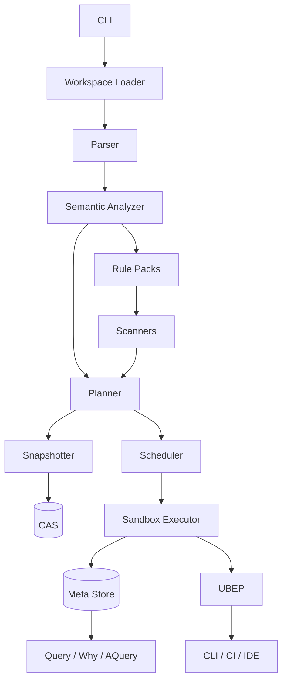

# UyaBuild 详细设计

## 1. 文档定位

- 文档状态：Draft v0.1
- 设计对象：`uya` 默认构建前端 `UyaBuild`
- 实现约束：主体使用 `Uya` 实现，仅保留极小 bootstrap shim
- 上游输入：[deep-research-report.md](./deep-research-report.md)

本文档将研究报告中的方向性结论收敛为可实现的详细设计，重点回答四个问题：

1. `UyaBuild` 的边界是什么。
2. `UyaBuild` 的核心抽象和执行模型是什么。
3. 为什么它能替代 `Makefile` 成为 `uya` 的默认构建入口。
4. 第一阶段应该怎样实现，才能既自举又可迁移。

## 2. 目标与非目标

### 2.1 目标

`UyaBuild` 的目标是成为 `uya` 生态统一的构建控制面，负责：

- 定义显式的目标图、动作图和产物契约。
- 以内容哈希而不是时间戳驱动增量构建。
- 为 C/C++、Node、Docker、多语言 monorepo 提供一等规则。
- 把 `build`、`test`、`query`、`why`、`release` 统一收敛到 `uya` 主命令。
- 用结构化事件、查询接口和可重放动作提升可观测性。
- 允许 `Make`、`CMake`、`Ninja`、`Bazel`、`Docker Buildx`、`npm` 作为互操作后端或外部子系统继续存在。

### 2.2 非目标

第一阶段不做以下事情：

- 不重新实现编译器、链接器、容器构建器、包管理器。
- 不强行替代 Bazel/CMake 的全部生态能力。
- 不在 MVP 就引入复杂宏语言或图灵完备构建脚本。
- 不把分布式远程执行作为首发能力。
- 不承诺第一天支持所有平台的沙箱与系统追踪；优先 Linux/macOS。

## 3. 核心设计原则

### 3.1 显式优于隐式

- 默认目标必须显式声明。
- 目标、任务、测试、镜像、服务是不同语义对象，不通过 `.PHONY` 之类机制伪装。
- 没有内建隐式规则搜索。
- 未知字段、未知标签、规则 schema 冲突在分析期报错。

### 3.2 内容优于时间

- 默认脏检查依据是内容摘要与动作指纹，不是文件修改时间。
- 动作缓存键必须包含命令、输入、发现性依赖、工具链、环境白名单和输出契约。
- early cutoff 为默认能力：动作执行后若输出内容不变，下游不继续重跑。

### 3.3 结构化优于字符串拼接

- `cxx.binary`、`node.app`、`oci.image` 等目标是结构化规则，不是 shell 命令模板。
- 规则包通过 schema、provider、scanner 三个维度扩展，而不是通过任意宏拼接命令。

### 3.4 可观测优于猜测

- 每个构建动作都能回答为什么执行、为什么跳过、为什么缓存 miss。
- CLI、CI、IDE 读取 `UBEP` 事件，而不是解析控制台文本。
- 失败动作必须可重放。

### 3.5 自举安全优于纯洁性

- `UyaBuild` 主体使用 `Uya` 编写。
- 保留一个极小 `bootstrap` 边界用于从现有 `uya` 编译器构建首个可运行 `uyabuild`。
- 不允许设计形成“必须先有 UyaBuild 才能构建 UyaBuild”的循环依赖。

## 4. 术语

| 术语 | 定义 |
|---|---|
| Workspace | 仓库根级别构建空间，默认由根 `uya.build` 中的 `workspace {}` 定义，也可兼容导入 `uya.toml` |
| Module | 一个可独立发布或复用的构建单元集合 |
| Package | 一个目录级目标命名空间，对应若干 `uya.build` |
| Label | 目标标识，格式为 `//pkg:path` |
| Target | 用户声明的逻辑目标，如 `cxx.library`、`task`、`service` |
| Action | 可执行的原子动作，含命令、输入、输出和执行属性 |
| Artifact | 动作或目标的受控产物 |
| Snapshot | 输入文件树的内容快照 |
| CAS | 内容寻址存储，用于文件、目录、日志、元数据 blob |
| UBEP | `Uya Build Event Protocol`，结构化构建事件协议 |
| Rule Pack | 一组目标 schema、provider、scanner、planner 逻辑 |
| Scanner | 用于补充发现性依赖的组件，如头文件扫描、depfile 解析 |
| Strict Mode | 严格模式。发现隐藏依赖、未声明输出、越权访问时直接失败 |

## 5. 用户可见模型

### 5.1 文件约定

用户面对的核心入口约定如下：

- `uya.build`：主入口文件。根文件可同时定义 `workspace`、模块、目标图与 `include` 关系。
- `uya.toml`：可选兼容清单。用于静态包元数据、外部工具集成或迁移期镜像配置，不作为构建图主来源。
- `.uya-build/`：本地构建状态目录，不入版本控制。

### 5.2 文件布局模式

`UyaBuild` 同时支持三种布局模式，但都以 `uya.build` 为主：

- 单文件模式：仓库根仅有一个 `uya.build`，其中同时声明 `workspace {}` 与构建目标，适合小中型项目。
- 分离模式：根 `uya.build` 负责 `workspace {}`、公共配置和 `include`，子目录中的 `uya.build` 负责局部目标，适合 monorepo。
- 兼容模式：根 `uya.build` 与可选 `uya.toml` 同时存在；`uya.build` 为权威来源，`uya.toml` 只保留静态元数据，重复字段必须一致，否则分析期报错。

### 5.3 主命令

第一阶段 CLI 统一到 `uyabuild` 主命令：

```text
uyabuild build //pkg:target
uyabuild test //tests/...
uyabuild check //...
uyabuild query //pkg/...
uyabuild aquery //app:cli
uyabuild why //app:cli
uyabuild explain file path/to/header.h
uyabuild plan //pkg:target --json
uyabuild replay <action-digest>
uyabuild diff-run <run-a> <run-b>
uyabuild release //dist:compiler
uyabuild install //dist:compiler
```

### 5.4 目标类型

首发内建目标类型如下：

| 分类 | 目标类型 | 用途 |
|---|---|---|
| 基础 | `task` | 非产物导向但可受控执行的任务 |
| C/C++ | `cxx.library` / `cxx.binary` / `cxx.test` | 编译、链接、测试 |
| Node | `node.workspace` / `node.app` / `node.package` | 前端构建、workspace、包发布 |
| OCI | `oci.image` | 容器镜像构建 |
| 发布 | `artifact` / `service` / `bundle` | 可分发产物和交付聚合单元 |
| 兼容 | `legacy.shell` / `external.make` / `external.cmake` / `external.bazel` | 渐进迁移与互操作 |

## 6. DSL 设计

### 6.1 语法约束

`UyaBuild` DSL 采用“声明式核心 + 受控逃逸层”的双层模型。

声明式核心约束如下：

- 仅保留单一赋值操作符 `=`
- 变量默认不可变
- 禁止基于目标顺序推导默认入口
- 不存在 tab 语义
- `deps`、`srcs`、`outputs`、`toolchain`、`env` 等字段均 schema 化
- 不允许规则实例写入 schema 外字段

受控逃逸层提供：

- `legacy.shell` 目标
- `script` 字段
- 明确的 `inputs`、`outputs`、`env_allowlist`
- 严格模式下结合追踪器校验隐藏依赖和未声明输出

### 6.2 语义模型

DSL 分三层求值：

1. 解析层：词法、语法、AST 生成。
2. 语义层：schema 校验、label 解析、配置展开、provider 推导。
3. 计划层：目标图转动作图、动作图转执行计划。

### 6.3 根文件规则

- `workspace {}` 只能出现在根 `uya.build`。
- 被 `include` 的子 `uya.build` 不得重复声明 `workspace {}`。
- 若存在 `uya.toml`，其中与 `workspace {}` 重叠的字段必须一致，否则直接失败。
- `uya.toml` 只承载静态元数据，不承载 `deps`、目标声明或执行语义。

### 6.4 示例

```uyabuild
workspace {
  name = "uya"
  default = ["//compiler:uya"]
  strict = true
}

config "debug" {
  defines = { mode = "debug" }
}

use cxx

cxx.library "//runtime:core" {
  srcs = glob("runtime/**/*.cc")
  hdrs = glob("runtime/**/*.h")
  include_dirs = ["runtime"]
  discover = cpp.headers()
}

cxx.binary "//compiler:uya" {
  srcs = ["compiler/main.cc"]
  deps = ["//runtime:core"]
  out = "out/bin/uyabuild"
  toolchain = "clang17"
}

task "//:fmt" {
  run = ["uya", "fmt", "."]
  always = true
}
```

## 7. 总体架构

### 7.1 逻辑分层



### 7.2 组件职责

| 组件 | 职责 | 关键输出 |
|---|---|---|
| CLI | 参数解析、命令分发、输出格式选择 | build 请求、query 请求、events 请求 |
| Loader | 发现根 `uya.build`、可选加载 `uya.toml` 兼容清单，并递归收集被 `include` 的 `uya.build` | 文件清单、模块索引 |
| Parser | 解析 DSL 为 AST | AST |
| Analyzer | schema 校验、label 绑定、配置展开、provider 解析 | Typed IR |
| Rule Packs | 内建规则及扩展规则定义 | 目标 schema、planner、scanner |
| Snapshotter | 路径标准化、文件摘要、目录 Merkle 树 | 快照对象、digest |
| Planner | 目标图转动作图，计算 action key | Action DAG |
| Scheduler | 拓扑调度、资源池、并行策略 | 执行序列 |
| Executor | 沙箱执行、日志缓冲、输出提交、依赖追踪 | Action result |
| Scanners | depfile、编译器扫描、文件系统追踪 | discovered deps |
| CAS | 文件/目录/日志内容寻址 | blob/object store |
| Meta Store | 运行记录、依赖记录、缓存索引、指标 | build history |
| UBEP | 结构化事件协议 | event stream |
| Query API | 图查询、脏因分析、回放定位 | graph view、why tree |

## 8. 仓库与模块组织建议

如果 `UyaBuild` 进入 `uya` 主仓，建议按如下模块拆分：

```text
//build/cli
//build/core
//build/dsl
//build/analyzer
//build/planner
//build/executor
//build/cas
//build/meta
//build/events
//build/query
//build/rules/cxx
//build/rules/node
//build/rules/oci
//build/rules/legacy
//build/adapters/make
//build/adapters/cmake
//build/adapters/bazel
//build/bootstrap
```

模块边界要求：

- `dsl` 不能依赖 `executor`
- `planner` 依赖 `analyzer` 输出的 typed IR，但不感知 CLI
- `rules/*` 不直接写数据库，只通过 planner/executor 提供的上下文 API 交互
- `adapters/*` 只负责互操作，不污染核心数据模型

## 9. 核心数据模型

### 9.1 Label

```text
Label {
  repo: string?         # 预留跨仓模块支持
  package: string       # 例如 compiler
  name: string          # 例如 uya
}
```

### 9.2 Target IR

```text
Target {
  label: Label
  kind: RuleKind
  attrs: AttrMap
  deps: [Label]
  visibility: [Pattern]
  providers: [Provider]
  tags: [string]
  config: ConfigInstance
}
```

### 9.3 Action

```text
Action {
  digest: string
  owner: Label
  mnemonic: string
  command: [string]
  working_dir: string
  declared_inputs: [ArtifactRef]
  discovered_inputs: [ArtifactRef]
  tools: [ToolRef]
  outputs: [OutputSpec]
  env_allowlist: [string]
  allow_network: bool
  execution_mode: pure | host | volatile
  pool: string?
  cache_policy: CachePolicy
}
```

### 9.4 Artifact 与 Output Contract

```text
Artifact {
  path: string
  digest: string
  type: file | directory | symlink | manifest | image_metadata
  producer: ActionDigest
}

OutputSpec {
  path: string
  kind: file | directory | tree
  optional: bool
  executable: bool
}
```

### 9.5 Action Record

```text
ActionRecord {
  action_digest: string
  started_at: timestamp
  finished_at: timestamp
  status: success | failed | cache_hit | skipped
  stdout_digest: string?
  stderr_digest: string?
  output_digests: [string]
  hidden_inputs: [string]
  undeclared_outputs: [string]
  exit_code: int?
}
```

### 9.6 Build Run

```text
BuildRun {
  run_id: string
  command: string
  requested_targets: [Label]
  profile: string?
  root_digest: string
  started_at: timestamp
  finished_at: timestamp?
  status: success | failed | cancelled
}
```

## 10. 构建流水线

### 10.1 阶段划分

完整构建过程分为九个阶段：

1. 发现 workspace 与模块。
2. 解析根 `uya.build`，并在需要时导入 `uya.toml` 兼容元数据。
3. schema 校验并产出 typed IR。
4. 扩展规则 provider，建立显式目标图。
5. 收集声明输入并创建文件快照。
6. 运行 scanner 或读取 depfile，补充发现性依赖。
7. 计算 action key，查询本地/远程缓存。
8. 缓存 miss 时进入沙箱执行，记录日志和读写痕迹。
9. 提交输出、更新元数据、发出 UBEP 事件。

### 10.2 动作键

动作键计算公式：

```text
action_key = blake3(
  rule_kind,
  rule_schema_version,
  normalized_command,
  declared_input_digests,
  discovered_input_digests,
  toolchain_digest,
  env_allowlist_values,
  platform,
  execution_mode,
  output_contract,
  mount_policy
)
```

规则：

- 命令行需先标准化，包括路径归一化和参数稳定排序。
- 环境变量只有白名单中的键值会影响键。
- 目录输入先序列化为 Merkle 根摘要。
- 动态发现的依赖必须纳入下一轮动作键重算。

### 10.3 early cutoff

动作执行成功后：

1. 对每个输出重新计算摘要。
2. 与上次成功执行的输出摘要比较。
3. 若全部一致，则动作结果记为 `success-no-change`。
4. 下游动作若仅依赖未变化输出，则可跳过重跑。

### 10.4 脏因分类

`uya why` 需要能把脏因归类为：

- 声明输入变化
- 发现性输入变化
- 工具链变化
- 环境变量变化
- 命令行变化
- 上游输出变化
- 缓存记录缺失
- 规则 schema 升级

## 11. 依赖模型

### 11.1 依赖分层

依赖模型分四层：

1. 结构依赖：目标之间的 `deps`
2. 文件依赖：`srcs`、`hdrs`、`outputs`
3. 工具链依赖：编译器、解释器、容器构建器、脚本运行时
4. 发现性依赖：头文件、生成文件、运行时读取文件、兼容层 shell 输入

### 11.2 发现性依赖来源

首发支持以下来源：

- 编译器 depfile
- C/C++ include 扫描
- Node workspace 图扫描
- Docker build context 与 Dockerfile 引用分析
- 文件系统追踪器
- 规则自定义 scanner

### 11.3 严格模式

严格模式下出现以下情况直接失败：

- 读取未声明且未允许发现的输入
- 写出未声明输出
- 写入源码树
- 越权访问未挂载目录
- 依赖绝对路径宿主状态但未进入 allowlist

兼容模式下行为：

- 允许执行
- 记录 UBEP 告警
- 把隐藏依赖写入 ActionRecord
- 提示用户将目标升级为结构化规则

## 12. 执行模型

### 12.1 执行模式

| 模式 | 说明 | 缓存策略 | 典型对象 |
|---|---|---|---|
| `pure` | 严格沙箱、仅依赖声明输入 | 本地缓存 + 可远程缓存 | 编译、打包、代码生成 |
| `host` | 允许读取有限宿主信息 | 本地缓存 | 读取系统 SDK、签名工具 |
| `volatile` | 非确定性或强依赖外部状态 | 默认不缓存 | 发布、上传、通知 |

### 12.2 沙箱约束

执行器为每个动作创建独立工作目录：

```text
.uya-build/tmp/<run-id>/<action-digest>/
```

挂载策略：

- 输入以只读方式映射或复制
- 输出目录预先创建且可写
- 工具链目录只读挂载
- 网络默认关闭，除非规则显式声明
- 工作目录执行成功后原子提交至目标输出路径

### 12.3 并行调度

调度器采用拓扑调度和资源池约束：

- 默认启用并行
- 通过 `pool` 控制稀缺资源
- 同一输出路径不能被多个动作声明
- 日志按动作缓冲，完成后统一输出或按事件流消费

建议内建资源池：

- `cpu`
- `link`
- `docker`
- `network`
- `license:<name>`

## 13. 存储设计

### 13.1 本地状态目录

```text
.uya-build/
  cas/
  meta/
  runs/
  tmp/
  locks/
  gc/
```

### 13.2 CAS

CAS 存储对象类型：

- 文件 blob
- 目录 tree
- stdout/stderr log
- action manifest
- build event chunk

对象键统一采用 `blake3`。

### 13.3 Meta Store

MVP 使用 `NoSQLite` 作为元数据存储，采用集合与索引模型而不是关系表。建议的顶层集合如下：

- `build_runs`
- `targets`
- `actions`
- `artifacts`
- `events`
- `cache_entries`
- `indexes`

建议的主查询索引如下：

- `build_runs.by_run_id`
- `actions.by_digest`
- `actions.by_owner`
- `actions.by_status`
- `artifacts.by_path`
- `cache_entries.by_action_digest`
- `events.by_run_id`

`NoSQLite` 选择理由：

- 文档结构更贴近 `ActionRecord`、`BuildRun`、事件流和发现性依赖这类嵌套元数据
- schema 演进成本更低，适合规则包和诊断字段持续扩展
- 更适合直接保存数组、对象和动态字段，减少关系化拆分
- 仍可通过二级索引满足 `query/aquery/why/replay` 的核心查询路径

## 14. UBEP 事件协议

UBEP 的稳定 schema 见 [ubep-event-schema.md](./ubep-event-schema.md)。本节保留设计动机与 MVP 事件集合。

### 14.1 目标

`UBEP` 负责替代“解析控制台输出”这种脆弱方案，服务：

- CLI 进度展示
- CI 构建报告
- IDE 状态同步
- 调试与历史分析

### 14.2 事件类型

MVP 事件集合：

- `BuildStarted`
- `WorkspaceLoaded`
- `TargetConfigured`
- `ActionPlanned`
- `ActionCacheChecked`
- `ActionScheduled`
- `ActionStarted`
- `ActionFinished`
- `ActionWarning`
- `TargetCompleted`
- `BuildMetrics`
- `BuildFinished`

### 14.3 事件格式

首发同时支持：

- 控制台文本摘要
- `ndjson`
- `json`

后续可扩展为二进制格式或 protobuf。

## 15. Query / Why / Replay 设计

### 15.1 `query`

提供目标图查询：

- `deps`
- `rdeps`
- `kind`
- `filter`
- `owner`

### 15.2 `aquery`

提供动作级查询：

- 动作命令行
- 输入/输出列表
- 动作键
- 缓存属性
- 资源池
- 执行模式

### 15.3 `why`

`why` 命令输出一棵解释树，说明：

- 请求目标是否脏
- 哪个上游先脏
- 触发重建的最小原因链

### 15.4 `replay`

`replay` 读取历史 ActionRecord 和 CAS 中的输入，重放失败动作：

- 自动恢复工作目录
- 恢复环境白名单
- 复原工具链引用
- 选择本地沙箱模式运行

## 16. 规则包与插件接口

### 16.1 Rule Pack 结构

每个规则包由四部分组成：

- schema：目标字段定义与校验
- provider：规则向其他规则暴露的结构化产物
- planner：把目标翻译为一个或多个动作
- scanner：补充发现性依赖

### 16.2 内建规则包

首发实现：

- `cxx`
- `node`
- `oci`
- `legacy`

### 16.3 插件 API 约束

插件必须：

- 声明版本
- 提供 schema 版本号
- 不得直接操作 CAS 或 Meta Store
- 通过宿主提供的 planner/executor API 交互
- 显式声明是否需要 scanner

### 16.4 `legacy.shell`

`legacy.shell` 是迁移关键，不是长期主路径。其字段建议：

```uyabuild
legacy.shell "//legacy:gen" {
  run = ["./scripts/gen.sh"]
  inputs = ["scripts/gen.sh", "config.yaml"]
  outputs = ["out/generated/**"]
  env_allowlist = ["PATH", "HOME"]
  allow_network = true
  mode = "compat"
}
```

兼容规则：

- `mode = "compat"` 默认允许追踪补依赖
- `mode = "strict"` 要求无隐藏输入
- 只有显式声明 `allow_network = true` 的动作才可访问宿主网络
- 必须声明输出

## 17. 互操作设计

### 17.1 Make

第一阶段只做包装与转发，不做全量语义翻译。

实现方式：

- `external.make` 目标
- `uya import make` 生成初始 `legacy.shell` 节点
- 保留 `make bootstrap` 作为冷启动边界

### 17.2 CMake

采用 `CMake File API + Presets`：

- `uya import cmake` 读取 codemodel
- 将 CMake 子项目视为外部受控节点
- 后续支持 `uya export cmake-presets`

### 17.3 Ninja

分两类集成：

- 导出 `build.ninja` 作为执行后端
- 读取 depfile、`compile_commands.json`、诊断工具结果

### 17.4 Bazel

首发只包装，不翻译 Starlark：

- `external.bazel` 调用 `bazel build`
- 消费 BEP、`query`、`aquery` 结果
- 后续再考虑远程缓存层协议兼容

### 17.5 Docker Buildx

`oci.image` 后端直接复用 Buildx：

- `--cache-from`
- `--cache-to`
- `--metadata-file`
- provenance

### 17.6 npm Workspaces

Node 规则需要理解：

- lockfile
- workspace 边界
- script 名称
- `node_modules/.bin`
- 输出目录

## 18. `uya` 自举与迁移设计

### 18.1 bootstrap 边界

保留一个极小 `bootstrap` 流程：

```text
make bootstrap
  -> 从纯 `uya` 源码构建首个 bin/uyabuild
  -> 之后所有开发者入口转向 uyabuild build/test/check/release/install
```

### 18.2 `uya` 现有入口映射

| 现有入口 | 新入口 |
|---|---|
| `make from-c` / `make from-c-native` | `make bootstrap` |
| `make uya` / `make uya-hosted` | `uyabuild build //compiler:uya` |
| `make tests` | `uyabuild test //tests/...` |
| `make check` | `uyabuild check //...` |
| `make release` | `uyabuild release //dist:compiler` |
| `make install` | `uyabuild install //dist:compiler` |

### 18.3 `uya` 仓内目标建议

```text
//bootstrap:seed
//runtime:core
//compiler:uya
//tests:unit
//tests:integration
//dist:compiler
//release:artifacts
```

## 19. 安全性与可复现性

### 19.1 安全边界

- 默认不写源码树
- 默认禁网
- 默认最小环境变量白名单
- `volatile` 动作不参与远程缓存

### 19.2 可复现性要求

以下信息必须进入动作指纹或元数据：

- 平台
- 工具链版本
- 环境白名单值
- 输入摘要
- 命令参数
- 规则 schema 版本

## 20. 测试策略

### 20.1 测试层级

- 单元测试：parser、schema、label、动作键计算
- 集成测试：规则包、scanner、沙箱执行
- 回归测试：null build、early cutoff、缓存 miss 原因
- 端到端测试：`uya` 仓自举、测试、发布主链路

### 20.2 关键测试样例

- 修改注释但产物内容不变，验证 early cutoff
- 增加隐藏头文件依赖，严格模式应失败
- 改变环境变量白名单值，动作键应变化
- 并行执行下日志不交错且结果确定
- `legacy.shell` 写出未声明输出时被记录或失败

## 21. 性能目标

MVP 目标值：

- 中型工程 `null build` 不重新执行动作
- 1 万目标规划阶段 p95 小于 300ms
- 本地二次构建命中率大于 85%
- 任意失败动作可 `replay`

## 22. MVP 范围

MVP 必须完成：

- 根 `uya.build` 基础加载，支持可选 `uya.toml` 兼容导入
- DSL parser + analyzer + typed IR
- `cxx`、`node`、`oci`、`legacy.shell` 四个规则包
- 本地 CAS + NoSQLite
- 本地沙箱执行器
- UBEP `ndjson/json`
- `build/query/aquery/why/replay`
- `make bootstrap` + `uya` 主仓切换路径

MVP 可以延后：

- 远程执行
- 复杂插件市场
- Windows 完整支持
- Bazel 深度互译
- 高级 IDE 持久化守护进程

## 23. 开放决策

以下问题需要在实现前尽快定案：

1. DSL 是否允许有限表达式和列表推导，还是完全保持静态声明式。
2. 系统追踪在 Linux/macOS 的技术路线是否统一。
3. 远程缓存协议是自定义还是兼容现有生态。
4. `legacy.shell` 的兼容窗口持续多久，何时开始强制 strict。
5. `Uya` 当前 CLI/标准库是否足够支撑高性能文件系统与进程编排。

## 24. 结论

`UyaBuild` 的设计核心不是“再造一个更现代的 Makefile”，而是把构建系统拆成显式目标图、内容寻址增量、受控执行语义和结构化可观测性四个层面，再以 `Uya` 本身完成自举。这使它既能服务 `uya` 编译器自身，也能逐步承接 C/C++、Node、Docker 和多语言 monorepo 的现代工程需求。
